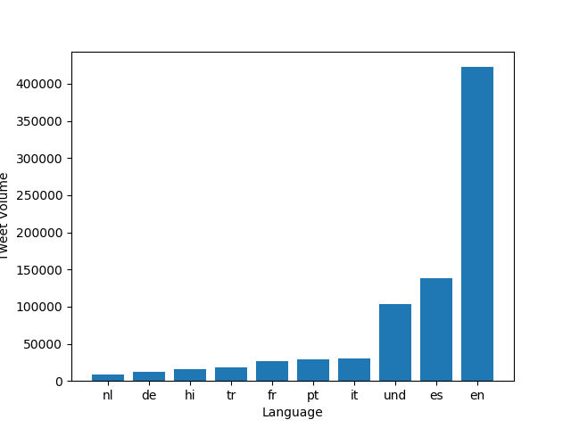
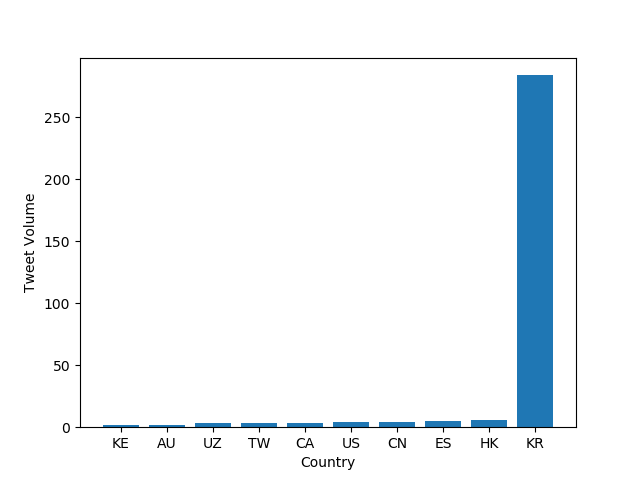
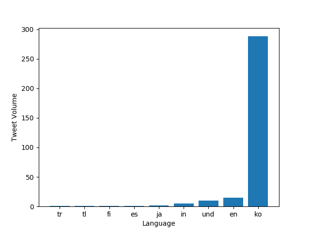
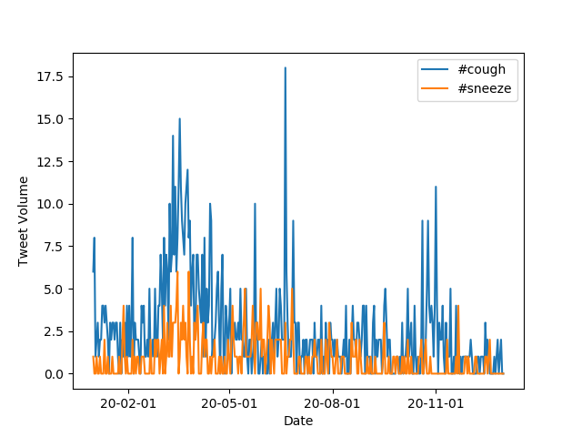

# Coronavirus twitter analysis

For this project, I analyzed tweets related to COVID-19 in the the 2020 using the mapreduce method and matplotlib data visualization library. Below is a brief summary of my code, as well as the graphs I made. 

**Background**

The dataset contained all geotagged tweets (1.1 billion) sent in the year 2020, and was given to me by my professor [Mike Izbicki](https://github.com/mikeizbicki). Although many more tweets were sent in 2020 that weren't geotagged, only using the geotagged tweets allows for analysis by country, which is interesting. 

**Analysis**

To start off, I used the `map.py` file to open a zip file for only a day of tweets and track the use of certain hashtags by both country and language. The command 
```
$ python3 ./src/map.py --input_path=/data/Twitter\ dataset/geoTwitter20-02-16.zip
```
creates a folder `outputs` that contains `/geoTwitter20-02-16.zip.lang`. This has all the information about tweets sent on February 16th in JSON format. 

The next step was to write a shell script `run_maps.sh` that would run map.py on all the days of the year. To run this script in the background so I didn't have to keep my server connection open, I ran the command
```
$ nohup sh run_maps.sh &
```
This executes `run_maps.sh` in the background, looping over all the day files. 

The `outputs` folder now contains 732 files, one for each day's language data and one for each day's country data (if you're thinking that 365 * 2 = 730, 2020 was actually a leap year! Hence the two extra files). 

Next up is `reduce.py`, which merges the files in the outputs folder into something that can be nicely visualized. Running these two commands
```
$ python3 ./src/reduce.py --input_paths outputs/geoTwitter20-*.lang --output_path=reduced.lang
$ python3 ./src/reduce.py --input_paths outputs/geoTwitter20-*.country --output_path=reduced.country
```
creates two condensed files `reduced_lang` and `reduced_country`. 

With langauge and country data condensed, I next ran `visualize.py`, which takes two arguments `--input_path` and `--key`. By running the command 
```
$ python3 ./src/visualize.py --input_path=reduced.lang --key='#coronavirus'
```
python produces

 

which shows the use of the hashtag #coronavirus in different languages. 

Here's the same hashtag, but by country, produced by running this command:

```
 $ python3 ./src/visualize.py --input_path=reduced.country --key='#coronavirus'
 ```



We could also track hashtags in different languages, too. Running the command:

```
python3 ./src/visualize.py --input_path=reduced.lang --key='#코로나바이러스'
```
we get usage of the hashtag #코로나바이러스 by language. 



Finally, running the command 

```
python3 ./src/visualize.py --input_path=reduced.country --key='#코로나바이러스'
```
we get the use of #코로나바이러스 by country


Not content to rest on my laurels, I also made an `alternative_reduce.py` file that takes one or more `--keys` as arguments and produces a line graph of those hashtags' use over every day in 2020. Running the command 
```
$ python3 ./src/alternative_reduce.py --keys '#cough' '#sneeze'
```

we get 



And that's all! Thanks for reading through. 
